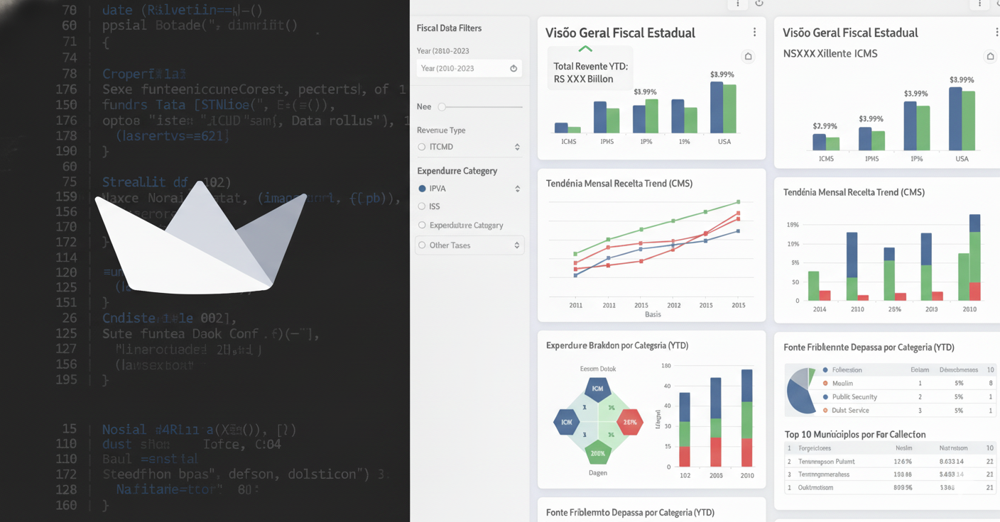

# Do dado ao dashboard: Documentando a construção do Painel Fiscal do Estado de Minas Gerais

A documentação completa sobre a metodologia, fontes de dados e processo de desenvolvimento do Painel de Transparência Fiscal de Minas Gerais.
Este site detalha como transformamos dados fiscais complexos em um dashboard interativo e compreensível, por meio de gráficos e visuais que podem ser utiizados para compor apresentações diversas sobre a situação fiscal do `Estado`.

??? note "Clique aqui para ver os detalhes"
    Este é o conteúdo que estará inicialmente escondido.

    - Você pode incluir listas.
    - Imagens.
    - E qualquer outro conteúdo Markdown.

## Commands

* `mkdocs new [dir-name]` - Create a new project.
* `mkdocs serve` - Start the live-reloading docs server.
* `mkdocs build` - Build the documentation site.
* `mkdocs -h` - Print help message and exit.

